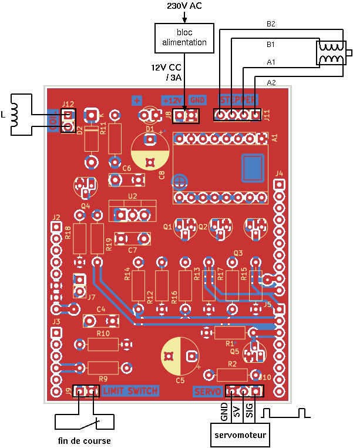
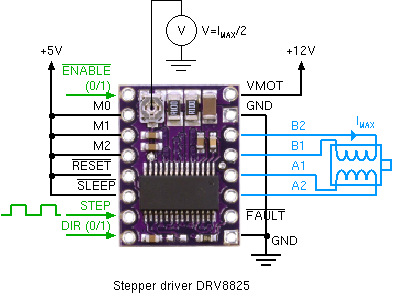

# PROJET GUITARE

## CONFIGURATION MATERIELLE

### description matérielle

Le schéma de la carte est présent [ici](docs/guitare_shield2_v2_shield.pdf).

La partie opérative de la guitare, comprend un moteur pas à pas, pour déplacer le chariot qui comprend un électro-aimant qui permet de pincer la corde, ainsi qu'un servomoteur.

Le shield guitare s'enfiche sur le bornier Arduino d'une STM32. Le shield dispose de plusieurs borniers sur lesquels viennent se connecter les différents éléments de la partie opérative, conformément à la figure ci-dessous.

### Liste et configuration des broches

* Solénoïde : broche PB10 en GPIO output high speed
* Servo-moteur FS5106B : commande Timer TIM3 channel 1 en PWM (broche PB4 - AF02)
* Moteur pas à pas
  - commande de vitesse par signal PWM (50%) de fréquence réglable généré par 
    le TIMER TIM1 CH1 (broche PA8 - AF01)
  - DIR : sens de rotation - broche PA9 output
  - EN  : enable - broche PC7 output
  
  
* Capteur fin de course : broche PB0 en GPIO + IRQ sur front montant

La configuration des broches (`io_configure`) est réalisée dans les fonctions `servo_init`, `solenoid_init`, et `stepper_init` dans `src/hardware.c`, à partir des définitions de broches de `include/config.h`.

## Organisation logicielle

Les drivers des périphériques sont disponibles dans le répertoire `lib`.

Le répertoire `src` contient 2 fichiers

- `main.c` qui contient l'application qui est construite autour d'une boucle qui récupère et traite les évènements fournis par les différents périphériques (UART, ADC, STEPPER).
- `hardware.c` qui implémente une API d'utilisation des différents éléments.

Vous êtes libre d'ajouter des fichiers à votre convenance de manière à structurer le projet.

## Fonctionnement de la guitare

Le servomoteur est utilisé pour gratter la corde et ainsi la faire vibrer.

Le solénoïde permet de pincer la corde pour modifier la longueur de corde. On obtient des fréquences de résonance différentes en fonction de cette longueur.

Le positionnement du solenoïde au moment du pincement de la corde est assuré par un moteur pas à pas de type NEMA17.

- le solénoïde : commande en tout ouu rien
- le servomoteur : il est commandé par un signal PWM de période 20 ms avec un rapport cyclique réglable tel que la largeur de l'impulsion varie de 0.5 ms à 2.5 ms pour obtenir une variation de l'angle de 0 à 180°. Il est à noter que la présence du transistor Q5 impose de complémeter le rapport cyclique (pour obtenir un rapport cyclique de 5%, il faut régler un rapport cyclique de 100-5=95%).
- le moteur pas à pas est de type NEMA17 avec 200 pas par tour. Il est commandé par l'intermédiaire d'un driver qui utilise 3 signaux de commande.
  * EN : actif au niveau bas, il permet de valider la commande du moteur.
  * DIR : il permet de choisir un sens de direction
  * STEP : une horloge permettant de piloter l'avancement d'un pas à chaque front.
  
  Le driver est configuré matériellement pour commander le moteur pas à pas par micropas (microstep). On a 32 micropas par pas du moteur, soit 6400 micropas par tour.

  Le moteur est commandé en boucle ouverte (classique pour ce type de moteur). La vitesse de rotation du moteur est liée à la fréquence du moteur par la relation
    
    `n [tr/s] = f [Hz] /6400`
    
  Le moteur a un vitesse de rotation limite au delà de laquelle, il décroche et n'est plus capable d'assurer l'égalité 1 front d'horloge = 1 micropas. Une méthode généralement utilisée pour éviter le risque de glissement est de commander le moteur en faisant varier la vitesse suivant un profil trapézoïdal.
  
  Un capteur de fin de course doit permettre à l'initialisation de venir mettre le chariot comportant le solénoïde en butée, puis de l'en éloigner jusqu'à une position qui servira de référence (position 0) pour les déplacements futurs.
    
  L'API développée doit permettre de positionner le chariot de manière précise.
    
  Une mesure de la vitesse de déplacement linéaire doit être réalisée pour valider la commande. Un plus serait l'implémentation du profil trapézoïdal.
    
  Voir le document [step_ctrl.pdf](docs/step_ctrl.pdf)
  
  **Interface PWM des timers** (`lib/timer.h`)

  La fonction `pwm_get_freq_cfg` permet calculer la configuration des registres du timer pour une fréquence de signal PWM donnée et de la stocker dans une structure de type `pwm_cfg_regs_t`.

  La fonction `pwm_channel_set_freq_duty` permet d'appliquer la configuration du paramètre de type `pwm_cfg_regs_t` à un canal donné et de rétablir le rapport cyclique (nécessaire lorsque la fréquence change).
  