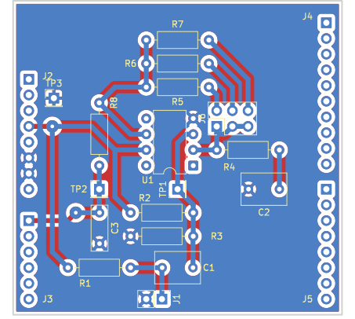

# PROJET SIGNAL

## CONFIGURATION MATERIELLE

### description matérielle

Le schéma de la carte est présent [ici](docs/microphone_shield.pdf).

Le shield microphone permet de connecter un microphone Electret (contenant un préampli), et de l'amplifier autour de `VCC/2`, avec `VCC=3.3V`.

Plusieurs valeurs d'amplification sont sélectionnables par un cavalier (x 22), (x 47) et (x 100).

Le signal amplifié est appliqué à l'entrée CH0 (broche PA0) de l'ADC1.

L'ajout d'un écran LCD par dessous le shield permet une visualisation directe du signal.

### Liste des broches utilisées

* Entrée CHANNEL_0 de l'ADC1 (PA0).
* Ecran LCD (voir `include/config.h`)

Broches GPIO auxiliaires
* PA10 : pour *voir* à l'oscilloscope le changement de buffer DMA (callback du DMA `on_smpl_buf_cb`)
* PA11 : pour *voir* à l'oscilloscope le temps d'exécution de la boucle principale (fonction `main`).

## Organisation logicielle

Le fichier `src/main.c` configure l'ADC1 en mode DMA. Le timer TIM2 est utilisé pour générer la fréquence d'échantillonnage du signal amplifié provenant du microphone.

Un évènement ADC_DMA_EVT est généré (à faire) par la callback du DMA lorsqu'un buffer a été complété.

Le signal présent dans le buffer est affiché sur un des graphes de l'écran LCD. L'autre graphe est réservé au calcul du spectre. Le calcul de la FFT peut être réalisé en utilisant la bibliothèque CMSIS-DSP qui implémente des algorithmes standards (et optimisés) de traitement du signal et est fournie sous forme précompilée.

Informations sur la bibliothèque [CMSIS-DSP](https://arm-software.github.io/CMSIS_5/DSP/html/group__RealFFT.html#ga3df1766d230532bc068fc4ed69d0fcdc)
